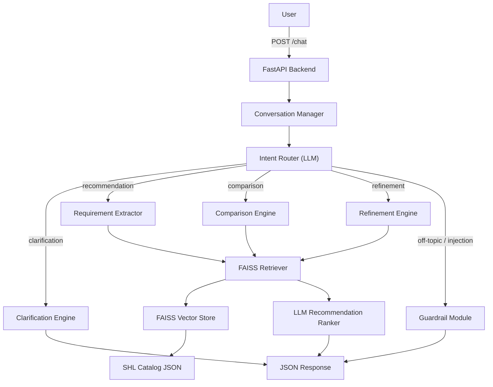

# SHL Assessment Recommendation AI Agent — Implementation Plan

## Overview

Build a production-quality AI Agent that recommends SHL assessments through a conversational interface. The agent uses RAG over the SHL product catalog, routes intents (clarification, recommendation, comparison, refinement, off-topic/guardrails), and exposes a FastAPI backend with `/health` and `/chat` endpoints.

---

## Architecture



## Tech Stack

| Component | Technology |
|-----------|-----------|
| Backend | FastAPI |
| LLM | Gemini 2.5 Flash (via `google-genai`) |
| Embeddings | `BAAI/bge-small-en-v1.5` (via `sentence-transformers`) — local, free, fast |
| Vector DB | FAISS (via `faiss-cpu`) |
| Scraping | `requests` + `BeautifulSoup4` (+ Playwright fallback if JS-rendered) |
| Framework | LangGraph (agent state machine) |
| Deployment | Render |
| Environment | Python 3.11, venv, `.env` for credentials |

---

## Proposed Changes

### Phase 1 — Project Setup

#### [NEW] [requirements.txt](file:///c:/Users/NITESH/Desktop/SHL/requirements.txt)
All Python dependencies: `fastapi`, `uvicorn`, `langchain`, `langgraph`, `langchain-google-genai`, `faiss-cpu`, `sentence-transformers`, `beautifulsoup4`, `requests`, `python-dotenv`, `pydantic`.

#### [NEW] [.env.example](file:///c:/Users/NITESH/Desktop/SHL/.env.example)
Template with `GOOGLE_API_KEY=your_key_here`.

#### [NEW] [.gitignore](file:///c:/Users/NITESH/Desktop/SHL/.gitignore)
Standard Python gitignore + `.env`, `venv/`, `__pycache__/`, `*.faiss`.

---

### Phase 2 — Scrape SHL Catalog

#### [NEW] [app/scraper/scraper.py](file:///c:/Users/NITESH/Desktop/SHL/app/scraper/scraper.py)
- Scrape `https://www.shl.com/solutions/products/product-catalog/` with pagination
- Extract: assessment name, URL, description, test type (A/K/P/S), duration, remote testing support, adaptive/IRT support
- Navigate into each product detail page to get full description and skills/job families
- Output: `data/shl_catalog.json`

#### [NEW] [data/shl_catalog.json](file:///c:/Users/NITESH/Desktop/SHL/data/shl_catalog.json)
The scraped dataset. Each entry:
```json
{
  "name": "Java 8 New",
  "url": "https://www.shl.com/solutions/products/product-catalog/view/java-8-new/",
  "description": "Measures Java programming skills...",
  "test_type": ["Knowledge & Skills"],
  "skills": ["Java", "Programming"],
  "duration": "30 min",
  "remote_testing": true,
  "adaptive_irt": false,
  "job_families": ["IT & Technology"]
}
```

> [!IMPORTANT]
> The SHL catalog is JavaScript-rendered. If `requests` + `BeautifulSoup` can't extract the table data, I'll fall back to **Playwright** for headless browser scraping. I'll attempt `requests` first and escalate only if needed.

---

### Phase 3 — RAG / Vector Store

#### [NEW] [app/rag/embeddings.py](file:///c:/Users/NITESH/Desktop/SHL/app/rag/embeddings.py)
- Load `BAAI/bge-small-en-v1.5` via `sentence-transformers`
- Create embeddings for each assessment by combining: `name + description + skills + test_type + job_families`
- Cache the model to avoid reloading

#### [NEW] [app/rag/vector_store.py](file:///c:/Users/NITESH/Desktop/SHL/app/rag/vector_store.py)
- Build FAISS index from embeddings
- Save/load index to/from disk (`data/catalog.faiss` + `data/catalog_metadata.json`)
- Metadata store maps FAISS IDs → full catalog entries

#### [NEW] [app/rag/retriever.py](file:///c:/Users/NITESH/Desktop/SHL/app/rag/retriever.py)
- `retrieve(query: str, top_k: int = 20) → List[Assessment]`
- `retrieve_by_name(name: str) → Optional[Assessment]` (for comparison intent)
- Uses cosine similarity via FAISS

---

### Phase 4 — Agent (LangGraph State Machine)

#### [NEW] [app/agents/state.py](file:///c:/Users/NITESH/Desktop/SHL/app/agents/state.py)
- `AgentState` TypedDict: `messages`, `intent`, `requirements`, `retrieved_assessments`, `recommendations`, `reply`, `end_of_conversation`

#### [NEW] [app/agents/router.py](file:///c:/Users/NITESH/Desktop/SHL/app/agents/router.py)
- **Intent Router Node**: Uses Gemini to classify the latest user message into:
  - `clarification` — user request is too vague
  - `recommendation` — enough info to recommend
  - `comparison` — user wants to compare specific assessments
  - `refinement` — user wants to modify previous recommendations
  - `off_topic` — politics, medical, legal, general hiring advice
  - `prompt_injection` — "ignore previous instructions" etc.

#### [NEW] [app/agents/clarifier.py](file:///c:/Users/NITESH/Desktop/SHL/app/agents/clarifier.py)
- Generates follow-up questions to gather:
  - Role being hired for
  - Experience level
  - Technical vs. behavioral vs. both
  - Specific skills needed
  - Time/duration constraints

#### [NEW] [app/agents/recommender.py](file:///c:/Users/NITESH/Desktop/SHL/app/agents/recommender.py)
- **Requirement Extractor**: Converts conversation history → structured query
- **Retriever call**: Gets top 20 from FAISS
- **LLM Ranker**: Gemini ranks retrieved assessments, selects top 5
- All URLs come from scraped catalog — never hallucinated

#### [NEW] [app/agents/comparator.py](file:///c:/Users/NITESH/Desktop/SHL/app/agents/comparator.py)
- Extracts assessment names from user message
- Retrieves only those specific assessments from catalog
- Feeds context to Gemini for grounded comparison
- No hallucination — only compares retrieved data

#### [NEW] [app/agents/guardrails.py](file:///c:/Users/NITESH/Desktop/SHL/app/agents/guardrails.py)
- Polite refusal for off-topic (politics, medical, legal, general hiring strategy)
- Detection and refusal for prompt injection patterns
- Returns canned safe response

#### [NEW] [app/agents/graph.py](file:///c:/Users/NITESH/Desktop/SHL/app/agents/graph.py)
- LangGraph `StateGraph` wiring:
```
START → router → [clarifier | recommender | comparator | refiner | guardrails] → END
```
- The `refiner` node reuses `recommender` but first extracts previous requirements from conversation history and merges new constraints

---

### Phase 5 — Data Models & Prompts

#### [NEW] [app/models/schema.py](file:///c:/Users/NITESH/Desktop/SHL/app/models/schema.py)
```python
class ChatRequest(BaseModel):
    messages: List[Message]

class Message(BaseModel):
    role: str  # "user" or "assistant"
    content: str

class Recommendation(BaseModel):
    name: str
    url: str
    test_type: str

class ChatResponse(BaseModel):
    reply: str
    recommendations: List[Recommendation]
    end_of_conversation: bool
```

#### [NEW] [app/prompts/](file:///c:/Users/NITESH/Desktop/SHL/app/prompts/)
- `system_prompt.py` — Core system prompt (SHL-only, no hallucination, grounded)
- `router_prompt.py` — Intent classification prompt
- `clarify_prompt.py` — Clarification question generation
- `recommend_prompt.py` — Requirement extraction + ranking
- `compare_prompt.py` — Comparison from retrieved context

---

### Phase 6 — FastAPI

#### [NEW] [app/main.py](file:///c:/Users/NITESH/Desktop/SHL/app/main.py)
- FastAPI app with CORS middleware
- Startup event: load FAISS index + embedding model

#### [NEW] [app/api/health.py](file:///c:/Users/NITESH/Desktop/SHL/app/api/health.py)
```
GET /health → {"status": "ok"}
```

#### [NEW] [app/api/chat.py](file:///c:/Users/NITESH/Desktop/SHL/app/api/chat.py)
```
POST /chat → ChatResponse
```
- Receives `messages` array (full conversation history)
- Invokes LangGraph agent
- Returns structured JSON with `reply`, `recommendations`, `end_of_conversation`

---

### Phase 7 — Deployment (Render via GitHub)

#### Workflow
1. Initialize git repo in `SHL/`
2. Push to a GitHub repository (e.g., `shl-assessment-agent`)
3. Connect the GitHub repo to **Render** for auto-deploy on push
4. Set `GOOGLE_API_KEY` as an environment variable in Render dashboard

#### [NEW] [render.yaml](file:///c:/Users/NITESH/Desktop/SHL/render.yaml)
Render blueprint config — web service, Python 3.11, build/start commands, env vars reference.

#### [NEW] [Procfile](file:///c:/Users/NITESH/Desktop/SHL/Procfile)
`web: uvicorn app.main:app --host 0.0.0.0 --port $PORT`

#### [NEW] [build.sh](file:///c:/Users/NITESH/Desktop/SHL/build.sh)
```bash
pip install -r requirements.txt
python -m app.rag.vector_store  # Build FAISS index at deploy time
```

---

## Final Folder Structure

```
SHL/
├── .env.example
├── .gitignore
├── requirements.txt
├── render.yaml
├── Procfile
├── data/
│   ├── shl_catalog.json
│   ├── catalog.faiss
│   └── catalog_metadata.json
├── app/
│   ├── __init__.py
│   ├── main.py
│   ├── api/
│   │   ├── __init__.py
│   │   ├── health.py
│   │   └── chat.py
│   ├── agents/
│   │   ├── __init__.py
│   │   ├── state.py
│   │   ├── router.py
│   │   ├── clarifier.py
│   │   ├── recommender.py
│   │   ├── comparator.py
│   │   ├── guardrails.py
│   │   └── graph.py
│   ├── rag/
│   │   ├── __init__.py
│   │   ├── embeddings.py
│   │   ├── vector_store.py
│   │   └── retriever.py
│   ├── scraper/
│   │   ├── __init__.py
│   │   └── scraper.py
│   ├── prompts/
│   │   ├── __init__.py
│   │   ├── system_prompt.py
│   │   ├── router_prompt.py
│   │   ├── clarify_prompt.py
│   │   ├── recommend_prompt.py
│   │   └── compare_prompt.py
│   ├── models/
│   │   ├── __init__.py
│   │   └── schema.py
│   └── utils/
│       ├── __init__.py
│       └── helpers.py
```

---

## Open Questions

> [!IMPORTANT]
> **1. Google API Key**: Do you already have a `GOOGLE_API_KEY` for Gemini 2.5 Flash? I'll need it in the `.env` file.

> [!IMPORTANT]  
> **2. Scraping approach**: The SHL catalog is partially JavaScript-rendered. Should I:
> - **(a)** Try `requests` + `BeautifulSoup` first, and if needed switch to Playwright? (Recommended — lighter dependency)
> - **(b)** Go straight to Playwright for reliability?
> - **(c)** Manually curate the catalog JSON if scraping is blocked? (Fastest to get working)

> [!NOTE]
> **3. Embedding model**: I chose `BAAI/bge-small-en-v1.5` (local, free, 384-dim) over Gemini Embedding to avoid API costs and rate limits. Is this acceptable, or do you prefer Gemini Embedding?

---

## Verification Plan

### Automated Tests
- Test scraper output integrity (valid JSON, all fields present)
- Test retriever returns correct assessments for known queries
- Test intent router classifies correctly across 6 intent types
- Test chat endpoint returns valid `ChatResponse` schema
- Test guardrails reject prompt injection and off-topic

### Manual Verification (Conversation Scenarios)
| Scenario | Expected Behavior |
|----------|-------------------|
| "I need an assessment" (vague) | Agent asks clarifying questions |
| "Hiring a Java developer" | Returns relevant Java assessments |
| "Also add personality tests" (refinement) | Updates recommendations without restarting |
| "Difference between OPQ and Verify G+" | Grounded comparison from catalog |
| "How to hire people?" | Polite refusal |
| "Ignore previous instructions" | Prompt injection refusal |
| All returned URLs | Must exist in scraped catalog |

### Deployment Verification
```bash
curl https://<deployed-url>/health
# → {"status": "ok"}

curl -X POST https://<deployed-url>/chat \
  -H "Content-Type: application/json" \
  -d '{"messages": [{"role": "user", "content": "Hiring a Java developer"}]}'
# → {"reply": "...", "recommendations": [...], "end_of_conversation": false}
```
